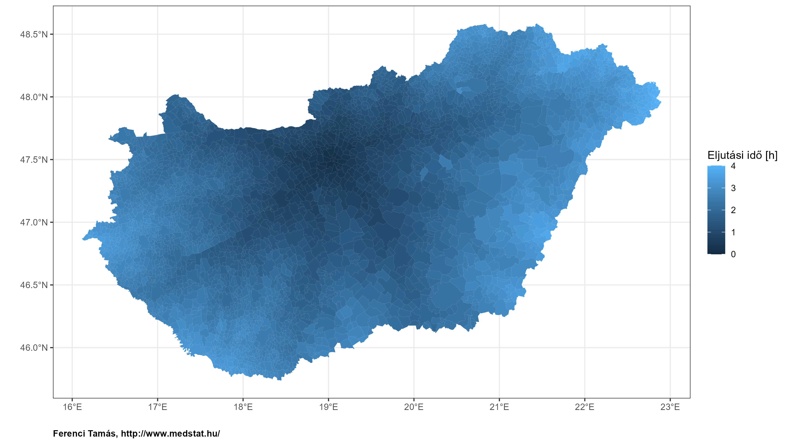
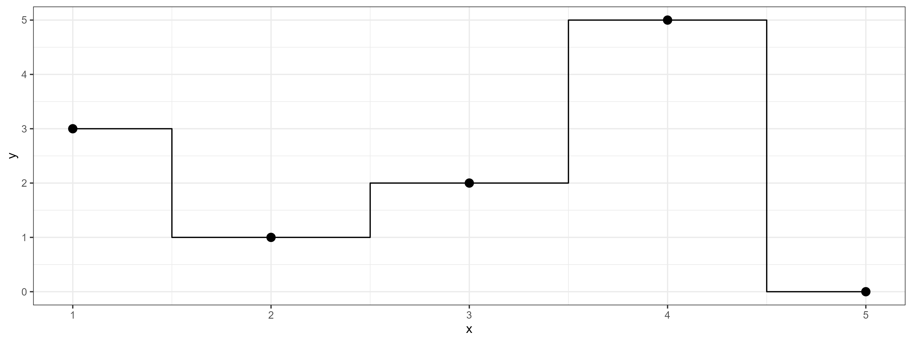
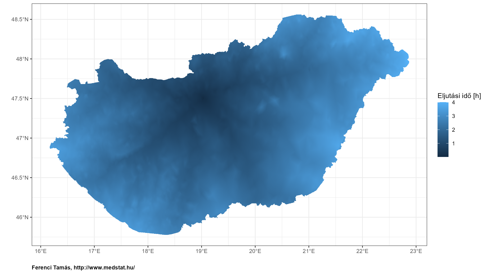
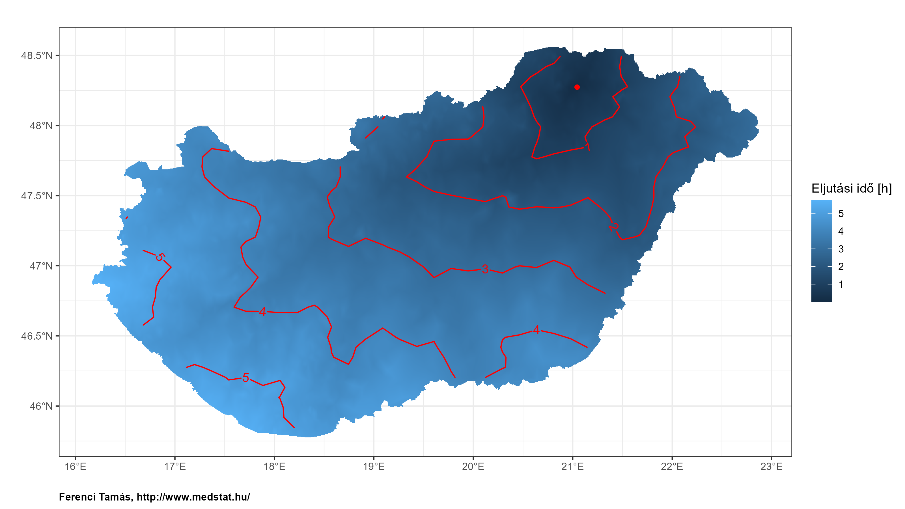
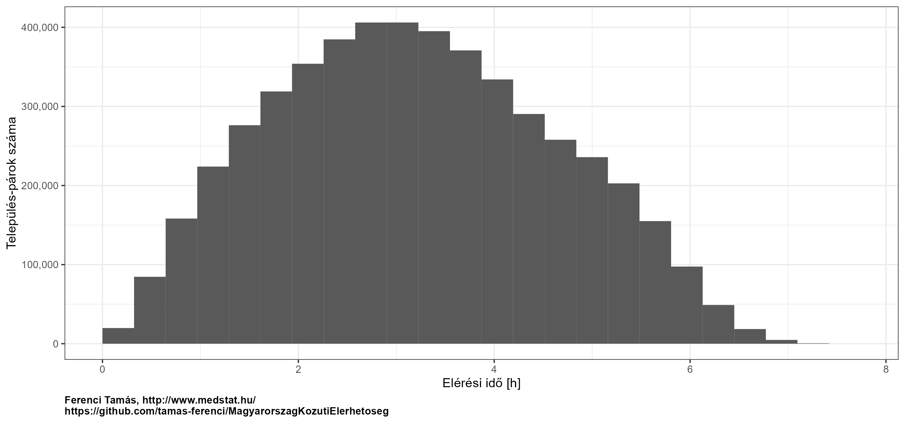
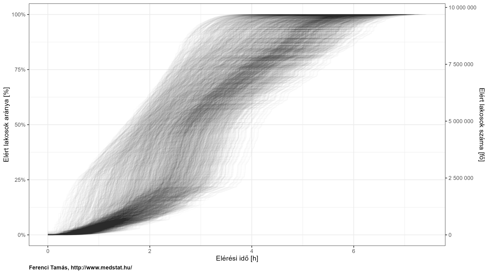
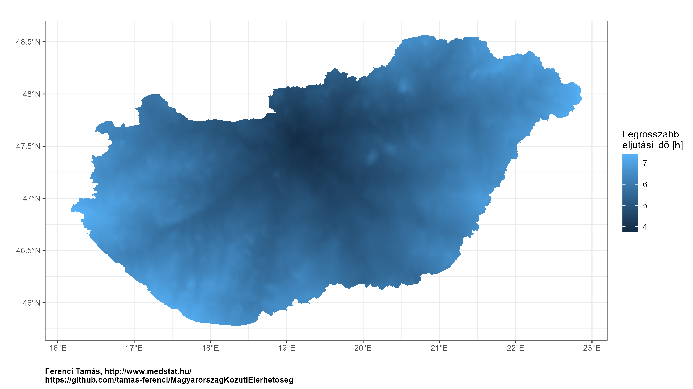
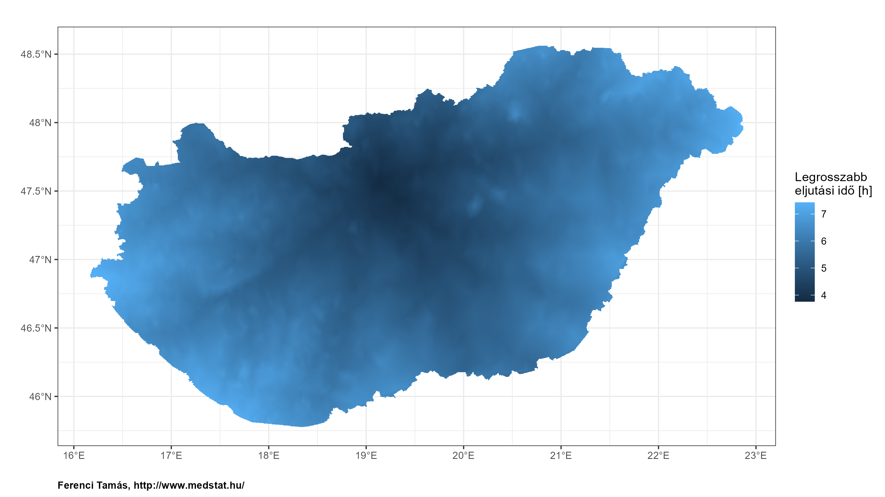
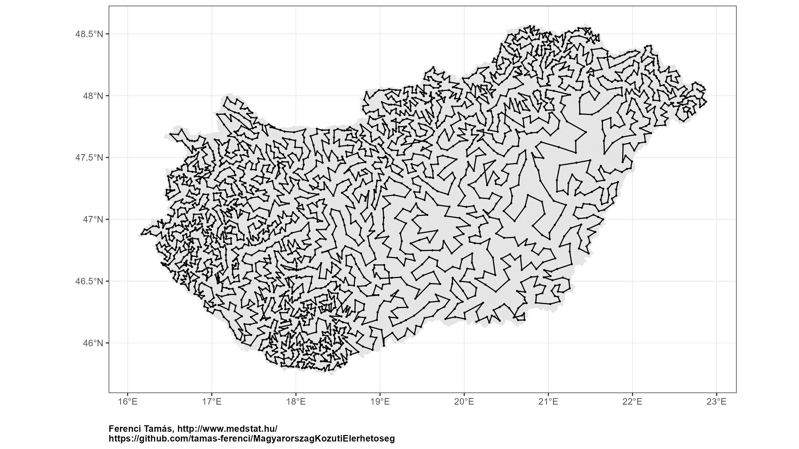

Magyar települések közúti elérhetősége
================
Ferenci Tamás (<tamas.ferenci@medstat.hu>)

- <a href="#kérdésfelvetés" id="toc-kérdésfelvetés">Kérdésfelvetés</a>
- <a href="#módszertan" id="toc-módszertan">Módszertan</a>
- <a href="#eredmények" id="toc-eredmények">Eredmények</a>
- <a href="#kis-történelmi-kitérő-az-izokrón-térképek-kapcsán"
  id="toc-kis-történelmi-kitérő-az-izokrón-térképek-kapcsán">Kis
  történelmi kitérő az izokrón térképek kapcsán</a>
- <a href="#az-elérési-idők-eloszlása-a-legtávolibb-magyar-települések"
  id="toc-az-elérési-idők-eloszlása-a-legtávolibb-magyar-települések">Az
  elérési idők eloszlása, a legtávolibb magyar települések</a>
- <a href="#az-egész-ország-átlagos-közelsége-egy-településről"
  id="toc-az-egész-ország-átlagos-közelsége-egy-településről">Az egész
  ország átlagos közelsége egy településről</a>
- <a href="#az-ország-középpontja-avagy-hová-telepítsünk-kórházat"
  id="toc-az-ország-középpontja-avagy-hová-telepítsünk-kórházat">Az ország
  középpontja, avagy hová telepítsünk kórházat?</a>
- <a
  href="#a-magyar-tsp-megoldása-hogy-lehet-leggyorsabban-körbejárni-az-összes-magyar-települést"
  id="toc-a-magyar-tsp-megoldása-hogy-lehet-leggyorsabban-körbejárni-az-összes-magyar-települést">A
  magyar TSP megoldása: hogy lehet leggyorsabban körbejárni az összes
  magyar települést?</a>
- <a href="#továbbfejlesztési-ötletek-kutatási-lehetőségek"
  id="toc-továbbfejlesztési-ötletek-kutatási-lehetőségek">Továbbfejlesztési
  ötletek, kutatási lehetőségek</a>
- <a href="#az-útvonaltervezés-technikai-részletei"
  id="toc-az-útvonaltervezés-technikai-részletei">Az útvonaltervezés
  technikai részletei</a>
  - <a href="#magyarország-térképe"
    id="toc-magyarország-térképe">Magyarország térképe</a>
  - <a href="#magyarország-településeinek-adatai"
    id="toc-magyarország-településeinek-adatai">Magyarország településeinek
    adatai</a>
  - <a href="#az-osrm-letöltése-és-telepítése"
    id="toc-az-osrm-letöltése-és-telepítése">Az OSRM letöltése és
    telepítése</a>
  - <a href="#a-térkép-letöltése-és-előkészítése"
    id="toc-a-térkép-letöltése-és-előkészítése">A térkép letöltése és
    előkészítése</a>
  - <a href="#az-útvonaltervezés-végrehajtása"
    id="toc-az-útvonaltervezés-végrehajtása">Az útvonaltervezés
    végrehajtása</a>

## Kérdésfelvetés

Sokan szinte nap mint nap használnak valamilyen útvonaltervező
programot. Ilyenekkel pillanatok alatt megkereshetjük, hogy melyik a
legrövidebb vagy leggyorsabb út két pont (legegyszerűbb esetben: két
település) között, de ezt látva felvetődhet az emberben: akkor már miért
nem bővítjük a vizsgálódásunk körét? Mi volna, ha *minden* magyar
település-pár között megkeresnénk a legrövidebb utat…? Nem is azért,
hogy a navigációt javítsuk, arra tökéletesek ezek az alkalmazások, hanem
azért, hogy a *rendszerről*, jelen esetben a magyar közúti rendszerről
megtudjunk valamit! Hogyan épül fel? Mely települések érhetőek el
gyorsabban, melyek lassabban? Adott településből hova lehet 1 órán belül
eljutni? Igaz, hogy Budapest-centrikus az útvonalhálózat? Mennyire erős
ez a hatás? Az ember eleresztheti jobban is a fantáziáját. Melyik két
magyar település van a legtávolabb – akár kilométerben, akár időben –
egymástól közúton? Mennyi a minimális út vagy idő, ami ahhoz szükséges,
hogy az összes magyar települést autóval felkeressük? (És mi az
optimális útvonal?) Melyik az a település, amire igaz, hogy a tőle vett
távolságok átlaga a legkisebb, azaz, ahonnan az átlagosan legkönnyebb
bárhová eljutni az országba? Na és amire igaz, hogy a tőle legtávolabbi
település távolsága a legkisebb? (A dolog persze szimmetrikus: akkor ide
a legkönnyebb eljutni bárhonnan. Hova érdemes kórházat telepíteni, ha
azt szeretnénk, hogy a leggyorsabban elérhető legyen, átlagosan, vagy
legrosszabb esetben is?)

Ezekre a kérdésekre fogok a jelen esszében megpróbálni válaszolni.

A problémakört szép nevén *közúti elérhetőségnek* lehetne nevezni.
Valójában nincs szó nagy újdonságról, sokaknak ismerős lehet a régi
autóstérképekről a kis táblázat, mely a nagy városok között tüntette fel
– táblázat alakban elrendezve az összes lehetséges pár között – a
távolságot. Ugyanezt fogjuk most megtenni, csak kihasználva az
informatika lehetőségeit sokkal alaposabban és átfogóbban, valamint a
kapott eredményeknek többféle alkalmazását is ki fogjuk próbálni.


## Módszertan

Több útvonaltervező alkalmazás van széles körű használatban, azonban nem
mindegyik támogatja (pláne könnyen) a nagyon sok település-pár közötti
tömeges lekérdezést, amire most szükségünk volna. Nem csak arról van
szó, hogy ez technikailag hogy oldható meg, hanem arról is, hogy ha
interneten kell a kéréseket átküldeni, az könnyen lehet, hogy nagyon
lassú lesz. Mindezekre tekintettel a választásom az
[OpenStreetMap](https://www.openstreetmap.org/) rendszerre esett. Ez
több fontos előnnyel is bír:

- Ingyenes és nagyon szabad licensszel bír.
- Az egész ország térképe letölthető (erre a célra a
  [Geofabrik](https://download.geofabrik.de/) oldalát használtam), így
  minden számítás elvégezhető off-line, a helyi számítógépen, internet
  szüksége nélkül.
- Elérhető hozzá olyan program, amely nagyon jó tulajdonságú és gyors
  útvonaltervezést végez a térkép alapján, ez az
  [OSRM](http://project-osrm.org/) (Open Source Routing Machine), ami
  ráadásul ingyenesen és nyílt forráskódú.

A fenti rendszer felállításának és az útvonaltervezés végrehajtásának a
technikai részleteit külön pontban tárgyalom meg.

Néhány megszorítást tegyünk. Az első, hogy most kizárólag *közúti*
eljutással fogunk foglalkozni. Ugyanígy feltehető azonban a kérdés
bármilyen más közlekedési módra, legyen az bicikli, gyaloglás, vagy akár
tömegközlekedés. Ezek vizsgálata továbbfejlesztési lehetőség; annyit
jegyzek meg, hogy az előbbiek vizsgálata nem nehéz, hiszen pontosan
ugyanaz a térkép, és ugyanaz az útvonaltervező használható (lényegében
csak az ún. profilt kell lecserélni az OSRM-ben), az utóbbi azonban
zűrösebb, hiszen a menetrendre is szükség van a vizsgálatához.

A második fontos megjegyzés, hogy a számítások eredménye függhet attól,
hogy mikor futtatjuk le. Ennek van egy kellemetlen, és van egy nagyon is
érdekes aspektusa. Az utóbbi a hosszú távú trend: továbbfejlesztési
lehetőségként felvethető, hogy ha mondjuk különböző években nézzük meg
az eredményeket, akkor vajon mutatkozik-e javulás Magyarország közúti
elérhetőségében? Ha igen, mekkora? Mikor volt nagyobb a javulás, mikor
volt kisebb? Mely területeken volt nagyobb javulás és mely területeken
kisebb? Ez tehát nem csak, hogy nem probléma, hanem ellenkezőleg, egy
potenciálisan nagyon izgalmas kutatási kérdés, a másik vetület azonban
káros: a rövid távú hatások. Egy útlezárás, felújítási munka stb.
megváltoztathatja a menetidőket, adott esetben nagyon rövid időre, és
ebből fakadóan minden érdemi jelentőség nélkül, de ha a térképet pont
ekkor töltöttük le, akkor ez megjelenhet benne. (Jobb ötletem nincs,
mint hogy ez ellen úgy lehetne védekezni, ha egy évben többször töltjük
le a térképet, és az eredményeket átlagoljuk. Most ilyet nem fogok
végezni.)

A harmadik szűkítés, hogy jelen esszében kizárólag eljutási *idővel*
fogok foglalkozni, *távolsággal* nem. Ennek egy rettenetesen
földhözragadt oka van, az, hogy az OSRM alapból időre optimalizál, és
csak [kézi barkácsolás
árán](https://github.com/Project-OSRM/osrm-backend/issues/4879) lehet
ezen változtatni. Ebbe most nem mentem bele, továbbfejlesztési
lehetőségként hagyom nyitva ezt a kérdést.

Minden számítást az [R statisztikai
környezet](https://www.youtube.com/c/FerenciTam%C3%A1s/playlists?view=50&sort=dd&shelf_id=2)
alatt végeztem el, a kódokat – a transzparencia és a nyílt tudomány
jegyében – ez a dokumentum teljes egészében tartalmazza. Ezeket az egyes
elemzéseknél külön-külön is közölni fogom, ha valakit ez nem érdekel, a
szürke hátteres részeket nyugodtan ugorja át.

## Eredmények

Ha megtervezzük az útvonalat az összes lehetséges településpár között,
akkor lényegében egy mátrixot kapunk, matematikai szóval élve. Ezeknek
csakugyan van [szép
matematikája](https://www.youtube.com/playlist?list=PLqdN24UCw5hl4sGgGrw0LLdT3GyshM_BW),
de a mostani céljainkra túlnyomó többségében az is elég lesz, ha
egyszerűen számok négyzet alakban elrendezett táblázataként gondolunk
rá, ahol egy adott szám megadja, hogy a sorában szereplő településből
mennyi idő alatt lehet eljutni az oszlopában szereplő településhez. Pont
mint az autóstérképek végében szokott lenni. Olvassuk is be az adatokat,
konvertáljuk az időtartamokat órába, mert eredetileg másodpercben van,
az OSRM így szolgáltatja, és nézzük is meg egy kis részletét ennek a
mátrixnak (táblázatnak):

``` r
durations <- fread("osrmdurations.csv")
durations <- as.matrix(durations)
rownames(durations) <- colnames(durations) <- locs$NAME
durations <- durations/60/60
kableExtra::column_spec(knitr::kable(durations[1:5, 1:5], format = "html"), 1, bold = TRUE)
```

<table>
<thead>
<tr>
<th style="text-align:left;">
</th>
<th style="text-align:right;">
Aba
</th>
<th style="text-align:right;">
Abádszalók
</th>
<th style="text-align:right;">
Abaliget
</th>
<th style="text-align:right;">
Abasár
</th>
<th style="text-align:right;">
Abaújalpár
</th>
</tr>
</thead>
<tbody>
<tr>
<td style="text-align:left;font-weight: bold;">
Aba
</td>
<td style="text-align:right;">
0.000000
</td>
<td style="text-align:right;">
2.918028
</td>
<td style="text-align:right;">
2.219889
</td>
<td style="text-align:right;">
2.084722
</td>
<td style="text-align:right;">
3.471139
</td>
</tr>
<tr>
<td style="text-align:left;font-weight: bold;">
Abádszalók
</td>
<td style="text-align:right;">
2.872611
</td>
<td style="text-align:right;">
0.000000
</td>
<td style="text-align:right;">
4.668250
</td>
<td style="text-align:right;">
1.551722
</td>
<td style="text-align:right;">
2.243694
</td>
</tr>
<tr>
<td style="text-align:left;font-weight: bold;">
Abaliget
</td>
<td style="text-align:right;">
2.215917
</td>
<td style="text-align:right;">
4.693556
</td>
<td style="text-align:right;">
0.000000
</td>
<td style="text-align:right;">
3.940139
</td>
<td style="text-align:right;">
5.326556
</td>
</tr>
<tr>
<td style="text-align:left;font-weight: bold;">
Abasár
</td>
<td style="text-align:right;">
2.079500
</td>
<td style="text-align:right;">
1.548000
</td>
<td style="text-align:right;">
3.931167
</td>
<td style="text-align:right;">
0.000000
</td>
<td style="text-align:right;">
1.980611
</td>
</tr>
<tr>
<td style="text-align:left;font-weight: bold;">
Abaújalpár
</td>
<td style="text-align:right;">
3.468972
</td>
<td style="text-align:right;">
2.248750
</td>
<td style="text-align:right;">
5.320639
</td>
<td style="text-align:right;">
1.975000
</td>
<td style="text-align:right;">
0.000000
</td>
</tr>
</tbody>
</table>

Ez természetesen csak egy pici részlet; az egész mátrixnak 3177 sora, és
persze ugyanennyi oszlopa van.

Az rögtön látható, és értelemszerű, hogy a főátlóban csupa 0 elem
található. A második észrevétel, hogy a mátrixunk nem *tökéletesen*
szimmetrikus. Eléggé az, de nem pontosan. Mindazonáltal a nagyobb
eltérések ritkák, és ahol elő is fordulnak, általában ott is valamilyen
nagyon partikuláris ok van a háttérben. (Példának okáért vegyük a
legnagyobb különbséget: Lórévből Rácalmás [24
perc](https://map.project-osrm.org/?z=12&center=47.011172%2C18.953140&loc=47.115742%2C18.896604&loc=47.025902%2C18.939328&hl=en&alt=0&srv=0),
de Rácalmásról Lórév [59
perc](https://map.project-osrm.org/?z=12&center=47.011172%2C18.953140&loc=47.025902%2C18.939328&loc=47.115742%2C18.896604&hl=en&alt=0&srv=0).
Megnézve azonban a belinkelt térképen a konkrét útvonalat, azonnal
kiderül, hogy valamiért a tervező-program azt hiszi, hogy a Lórév és
Adony közötti kompon csak az egyik irányban lehet átkelni, ami elég
furcsa lenne, és persze [nincs is
így](http://www.adony.hu/kozlekedes/revatkelo/).) Bizonyos célokra
célszerűbb lehet szimmetrizálni a mátrixot (kiátlagolni a két értéket;
mátrixos nyelven szólva: összeadva a mátrixot a transzponáltjával és
elosztva 2-vel); az előbbiekből látható, hogy nagy módosítást ez nem
jelent.

A későbbi feldolgozáshoz célszerű lehet, ha átrendezzük egy olyan
formátumba az adatokat, melyben minden sor egy pár (adattudósok úgy
mondanák: long formátum). Ha ezt megtesszük, akkor ráadásul a két típusú
adat kényelmesen tárolható egyetlen objektumban:

``` r
durationsLong <- as.data.table(reshape2::melt(durations, value.name = "Duration"))
durationsLong$Var1 <- as.character(levels(durationsLong$Var1))[durationsLong$Var1]
durationsLong$Var2 <- as.character(levels(durationsLong$Var2))[durationsLong$Var2]
fwrite(durationsLong, "durationsLong.csv", dec = ",", sep = ";", bom = TRUE)
knitr::kable(head(durationsLong))
```

<table>
<thead>
<tr>
<th style="text-align:left;">
Var1
</th>
<th style="text-align:left;">
Var2
</th>
<th style="text-align:right;">
Duration
</th>
</tr>
</thead>
<tbody>
<tr>
<td style="text-align:left;">
Aba
</td>
<td style="text-align:left;">
Aba
</td>
<td style="text-align:right;">
0.000000
</td>
</tr>
<tr>
<td style="text-align:left;">
Abádszalók
</td>
<td style="text-align:left;">
Aba
</td>
<td style="text-align:right;">
2.872611
</td>
</tr>
<tr>
<td style="text-align:left;">
Abaliget
</td>
<td style="text-align:left;">
Aba
</td>
<td style="text-align:right;">
2.215917
</td>
</tr>
<tr>
<td style="text-align:left;">
Abasár
</td>
<td style="text-align:left;">
Aba
</td>
<td style="text-align:right;">
2.079500
</td>
</tr>
<tr>
<td style="text-align:left;">
Abaújalpár
</td>
<td style="text-align:left;">
Aba
</td>
<td style="text-align:right;">
3.468972
</td>
</tr>
<tr>
<td style="text-align:left;">
Abaújkér
</td>
<td style="text-align:left;">
Aba
</td>
<td style="text-align:right;">
3.362333
</td>
</tr>
</tbody>
</table>

Az adatállomány [ezen a linken](TODO) külön is elérhetővé tettem CSV
formátumban, hogy bárki tetszőleges saját elemzéshez is felhasználhassa.

Most már nekiállhatunk a munkának! Első feladatként nézzük meg, hogy
milyen messze vannak (menetidőben) a magyar települések egy bizonyos
ponttól; legyen ez Budapest, 1. kerület (ha már a 0 kilométerkő itt
van):

``` r
knitr::kable(head(durationsLong[Var1=="Budapest 01. kerület"]))
```

<table>
<thead>
<tr>
<th style="text-align:left;">
Var1
</th>
<th style="text-align:left;">
Var2
</th>
<th style="text-align:right;">
Duration
</th>
</tr>
</thead>
<tbody>
<tr>
<td style="text-align:left;">
Budapest 01. kerület
</td>
<td style="text-align:left;">
Aba
</td>
<td style="text-align:right;">
0.9066667
</td>
</tr>
<tr>
<td style="text-align:left;">
Budapest 01. kerület
</td>
<td style="text-align:left;">
Abádszalók
</td>
<td style="text-align:right;">
2.2096389
</td>
</tr>
<tr>
<td style="text-align:left;">
Budapest 01. kerület
</td>
<td style="text-align:left;">
Abaliget
</td>
<td style="text-align:right;">
2.7583333
</td>
</tr>
<tr>
<td style="text-align:left;">
Budapest 01. kerület
</td>
<td style="text-align:left;">
Abasár
</td>
<td style="text-align:right;">
1.2558333
</td>
</tr>
<tr>
<td style="text-align:left;">
Budapest 01. kerület
</td>
<td style="text-align:left;">
Abaújalpár
</td>
<td style="text-align:right;">
2.6422500
</td>
</tr>
<tr>
<td style="text-align:left;">
Budapest 01. kerület
</td>
<td style="text-align:left;">
Abaújkér
</td>
<td style="text-align:right;">
2.5355000
</td>
</tr>
</tbody>
</table>

És most jön a lényeg. Hogyan ábrázoljuk ezt? Célszerűen térképen!
Egyszerűen színezzük be az összes települést az itt látható idővel
arányosan, így egy látványos, azonnal áttekinthető ábrává konvertáljuk
ezt a nagyon hosszú adathalmazt:

``` r
ggplot(merge(geodata, merge(locs, durationsLong[Var1=="Budapest 01. kerület", .(NAME = Var2, Duration)])),
       aes(x = X, y = Y, fill = Duration)) + geom_sf(color = NA) +
  labs(x = "", y = "", fill = "Eljutási idő [h]", caption = captionlab)
```

<!-- -->

Az egyetlen probléma, hogy élesen látszódnak az egyes települések
körvonalai. (A térkép a településeket nem pontként jeleníti meg, hanem
egy kis területet rendel hozzájuk úgy, hogy átfedésmentesek legyenek, és
együtt kiadják az egész országot.) Ez egyáltalán nem hibás, de pusztán
esztétikai értelemben zavaró lehet, ha mi inkább egy összképet akarunk
látni. Azt kellene ehhez elérni, hogy ne legyenek ilyen éles ugrások.
Egy lehetséges megoldás a simítás, jobban mondva jelen esetben az
interpoláció: azt elérni, hogy az értékek ne hirtelen ugorjanak át a két
település határán, hanem folytonos legyen az átmenet. Ehhez a
településeket most egyetlen pontnak fogjuk tekinteni (ami nem más lesz,
mint a kis területek középpontja), ahhoz rendeljük az értékeket, és azok
között fogunk lineárisan interpolálni. Illusztrálva mindezt, azt
mondhatjuk, hogy e helyett a színezés helyett (a pontok a városok, a
függőleges tengely a szín intenzitása):

``` r
interppelda <- data.frame(x = 1:5, y = c(3, 1, 2, 5, 0))
ggplot(interppelda, aes(x = x, y = y)) + geom_point(size = 3) + geom_step(direction = "mid")
```

<!-- -->

A következő színezést használjuk:

``` r
ggplot(interppelda, aes(x = x, y = y)) + geom_point(size = 3) + geom_line()
```

<!-- -->

A mi konkrét helyzetünk két szempontból nehezebb mint a fenti
illusztráció: egyrészt nem egy, hanem két dimenzióban vagyunk, tehát a
pontok a síkban helyezkednek el, és minden irányban lehetnek
szomszédaik, másrészt nem szép szabályos rácspontokban vannak, hanem
össze-vissza. Mindezek kezelésére vannak bevált algoritmusok, mi most
[Akima módszerét](https://dl.acm.org/doi/10.1145/355780.355786) fogjuk
használni (amit az R-ben az `akima` csomag megvalósít). Ez végrehajtja
az interpolációt, majd az eredményeket egyenletes rácspontokban adja
vissza, melyek lefedik az ország területét. Ez utóbbi miatt még egy
lépésre szükség van: ki kell szűrnünk azokat a pontokat, amik az ország
határain kívül vannak, hiszen a fenti rácsnak lesznek ilyen pontjai is.

Ezzel kapjuk a végleges ábránkat, az ország minden településének
elérhetőségét a 0 kilométerkőtől indulva:

``` r
bpcontour <- merge(durationsLong[Var1=="Budapest 01. kerület", .(NAME = Var2, Duration)], locs)[
  , with(akima::interp(X, Y, Duration, nx = 1000, ny = 1000),
         cbind(CJ(Y = y, X = x), Duration = c(z))[!is.na(Duration)])]
bpcontour <- bpcontour[sapply(st_intersects(st_as_sf(bpcontour, coords = c("X", "Y"),
                                                     crs = st_crs(geodata)), geodata), length)==1]

p <- ggplot(bpcontour, aes(x = X, y = Y)) + geom_raster(aes(fill = Duration)) +
  labs(x = "", y = "", fill = "Eljutási idő [h]", caption = captionlab) +
  metR::scale_x_longitude(ticks = 1, expand = waiver()) +
  metR::scale_y_latitude(ticks = 0.5, expand = waiver())
ggsave("BudapestKozutiEljutasiIdo.pdf", p, width = 16, height = 9, device = cairo_pdf)
p
```

<!-- -->

Ha egy szubjektív kiszólást tehetek, ez az ábra szerintem önmagában is
szép: mint ahogy az erek hálózzák be a testet. (Ha más is így gondolná,
letöltheti jó minőségű [PDF formátumban](TODO) is ugyanezt az ábrát!)

Mindazonáltal az ábra még tovább is fejleszthető. Vegyünk most egy másik
települést példának, a Borsod-Abaúj-Zemplén megyei
[Csobádot](https://hu.wikipedia.org/wiki/Csob%C3%A1d). Az előbbi ábrát
egészítsük ki egy ponttal, ahol a település van, de ami még fontosabb:
jelöljük meg azokat a pontokat, amelyek adott időn belül, például 1 órán
belül, 2 órán belül stb. elérhetőek a vizsgált településünkből. E
területek határát szokás izokrón görbének nevezni (kb. azonos idő alatt
elérhető): adott idő alatt eddig lehet eljutni a településből. Avagy,
fordítva megfogalmazva – minthogy a dolog szimmetrikus – innen lehet
adott idő alatt eljutni a településre. Technikailag egy dologra kell
figyelni, ez pedig az, hogy az eredeti interpoláció nagyon finom térbeli
felbontású, ami jó, hiszen ettől szép sima a térkép, viszont most nem
szerencsés, mert ha ez alapján húzzuk meg ezeket a kontúrvonalakat,
akkor azok nagyon szaggatottak lesznek, hiszen ide-oda fog ugrálni, hogy
pontosan hol van az 1 óra határa (és a finom felbontás miatt ezt jól
tudja követni). Úgyhogy ehhez érdemes egy durvább felbontású
interpolációt készíteni, és az alapján behúzni az izokrón vonalakat:

``` r
contourplotter <- function(datain, geodatain, lab, telepules = NA, hascontour = FALSE) {
  telepulescontour <- datain[, with(akima::interp(X, Y, value, nx = 1000, ny = 1000),
                                    cbind(CJ(Y = y, X = x), value = c(z))[!is.na(value)])]
  telepulescontour <- telepulescontour[sapply(st_intersects(st_as_sf(telepulescontour, coords = c("X", "Y"),
                                                                     crs = st_crs(geodatain)), geodatain),
                                              length)==1]
  
  telepulescontour2 <- datain[, with(akima::interp(X, Y, value, nx = 40, ny = 40),
                                     cbind(CJ(Y = y, X = x), value = c(z))[!is.na(value)])]
  telepulescontour2 <- telepulescontour2[sapply(st_intersects(st_as_sf(telepulescontour2,
                                                                       coords = c("X", "Y"),
                                                                       crs = st_crs(geodatain)), geodatain),
                                                length)==1]
  
  ggplot(telepulescontour, aes(x = X, y = Y)) + geom_raster(aes(fill = value)) +
    {if(!is.na(telepules)) stat_sf_coordinates(data = geodatain[geodatain$NAME==telepules,],
                                               inherit.aes = FALSE, color = "red")} +
    {if(hascontour) metR::geom_contour2(data = telepulescontour2, aes(x = X, y = Y, z = value,
                                                                      label = after_stat(level)),
                                        inherit.aes = FALSE, breaks = 1:10, skip = 0, color = "red")} +
    labs(x = "", y = "", fill = lab, caption = captionlab) +
    metR::scale_x_longitude(ticks = 1, expand = waiver()) +
    metR::scale_y_latitude(ticks = 0.5, expand = waiver())
}
contourplotter(merge(durationsLong[Var1=="Csobád", .(NAME = Var2, value = Duration)], locs), geodata,
               "Eljutási idő [h]", "Csobád", TRUE)
```

<!-- -->

Érdemes megnézni, hogy – bár jóval halványabban és elmosódottabban – de
az autópályák itt is látszanak: sok település eléréséhez az a jó
stratégia Csobádról indulva, ha előbb feljövünk a fővárosba.

Most, hogy a fenti térkép megvan, és minden ezzel kapcsolatos nehézséget
leküzdöttünk, gondolkozhatunk eggyel nagyobban is: miért nem csináljuk
meg ezt az *összes* magyar településre? A dolog innen már tényleg nem
nehéz, lényegében csak automatizálni kell a fentieket. Mindenben
követjük a fent látott algoritmust, csak egyetlen kiegészítést érdemes
tenni: célszerű egyetlen, nagy, long formátumú fájlba összefogni az
összes lehetséges paramétert, beleértve a fenti $n$-et (az interpoláció
finomságát) is. Ez azért lesz kedvező, mert később a `data.table`
harmadik (csoportosító) argumentuma így jól kihasználható: pontosan
ugyanazt a függvényt kell meghívni, $n$ értékétől függetlenül, azaz a
kód teljesen egységes lesz. (A megközelítés célszerűségét mutatja, hogy
ha például a későbbiekben nem csak időnk, hanem távolságunk is lesz,
akkor a világon semmilyen módosításra nem lesz szükség a kódban,
egyszerűen azt is `melt`-eljük, és beírjuk a harmadik argumentumok közé
a csoportosításban.)

Tehát, első lépésben kikeressük adott kiinduló településhez (`Var1`) a
céltelepülések (`Var2`) koordinátáit:

``` r
contourdata <- merge(durationsLong[, .(Var1, NAME = Var2, Duration)], locs, sort = FALSE)
```

Ezt követően megduplázzuk az adatbázist, egyszer a 40-es (durva
felbontású), egyszer pedig a finom felbontású interpolációhoz szükséges
$n$ paramétert mellérakva:

``` r
contourdata <- rbind(cbind(contourdata, n = 40), cbind(contourdata, n = 500))
```

Ez után jöhet az előbb említett előny, a `data.table` segítségével
egyetlen lépésben elintézhető az interpoláció: minden
kiindulótelepülésen és minden $n$ paraméteren végig kell mennünk.
Egyedül arra kell figyelnünk, hogy az `akima::interp` eredményét
megfelelően alakítsuk át: ez alapváltozatában egy vektorban adja vissza
az $x$ és $y$ koordinátákat, és egy mátrixban a hozzájuk tartozó
interpolált értékeket. Ahhoz, hogy long formátumot kapjunk ebből az
egészből, két dologra van szükség: egyrészt vesszük a koordináták direkt
szorzatát (összes lehetséges párját) `CJ` függvénnyel, majd a mátrixot
vektorrá alakítjuk. Ez utóbbit a `c` megteszi, mégpedig oszloponként,
ezért ha a `CJ`-ben az $y$-t írjuk először, akkor pont jól kapjuk meg az
adatokat. Egyetlen dolgot kell még tennünk: az interpoláció azon
pontokra, melyek nagyon kívül esnek a bemenő pontok tartományán, `NA`-t
fog visszaadni (lévén, hogy extrapolációt nem végzünk). Ezeket kidobjuk,
de megjegyzendő, hogy ezzel a problémával még kell foglalkoznunk, mert
így is lesznek az ország határain kívüli pontok. Végeredményben tehát a
szükséges kód:

``` r
contourdata <- contourdata[, with(akima::interp(X, Y, Duration, nx = n, ny = n),
                                  cbind(CJ(Y = y, X = x), Duration = c(z))[!is.na(Duration)]), .(Var1, n)]
```

Most jöhet a határokon kívüli pontok kidobása. Mivel a fenti tábla
nagyon hosszú, és rengeteg ismétlődő koordináta van benne, így nem
érdemes minden sorát külön szűrni. Jobban járunk, ha kiszedjük az egyedi
koordinátákat, azokat szűrjük le aszerint, hogy az ország határain belül
vannak, majd az így kapott táblázatot visszaegyesítjük a nagy táblánkkal
(hozva a jelölést, hogy melyik koordináta van belül). Ezt használva
aztán kiszűrhetjük a szükséges pontokat, sokkal gyorsabban, mintha
minden ponton végigmennénk:

``` r
uniquecoords <- unique(contourdata[, .(X, Y)])
uniquecoords$coordOK <- sapply(st_intersects(st_as_sf(uniquecoords, coords = c("X", "Y"),
                                                      crs = st_crs(geodata)), geodata), length)

contourdata <- merge(contourdata, uniquecoords, by = c("X", "Y"))
contourdata <- contourdata[coordOK==1]
contourdata <- contourdata[, .(Var1, n, X, Y, Duration)]
saveRDS(contourdata, "contourdata.rds")
```

Innen már nincs más dolgunk, mint elvégezni a térképezést minden egyes
településre. Elkészítünk egy izokrón vonalakat tartalmazó, és egy a
nélküli térképet is minden településre, és az eredményeket PNG és PDF
formátumokban is kimentjük, kinek mi lesz majd a célszerű:

``` r
for(loc in locs$NAME) {
  p <- ggplot(contourdata[Var1==loc&n==500], aes(x = X, y = Y)) + geom_raster(aes(fill = Duration)) +
    stat_sf_coordinates(data = geodata[geodata$NAME==loc,], inherit.aes = FALSE, color = "red") +
    labs(x = "", y = "", fill = "Eljutási idő [h]", caption = captionlab) +
    metR::scale_x_longitude(ticks = 1, expand = waiver()) +
    metR::scale_y_latitude(ticks = 0.5, expand = waiver())
  p1 <- p + metR::geom_contour2(data = contourdata[Var1==loc&n==40],
                                aes(x = X, y = Y, z = Duration, label = after_stat(level)),
                                inherit.aes = FALSE, breaks = 1:10, skip = 0, color = "red")
  
  ggsave(paste0("./results/", stringi::stri_replace_all_fixed(iconv(loc, to = "ASCII//TRANSLIT"),
                                                              c(" ", "-", "."), "", vectorize_all = FALSE),
                ".png"), p, width = 16, height = 9)
  ggsave(paste0("./results/", stringi::stri_replace_all_fixed(iconv(loc, to = "ASCII//TRANSLIT"),
                                                              c(" ", "-", "."), "", vectorize_all = FALSE),
                ".pdf"), p, width = 16, height = 9, device = cairo_pdf)
  ggsave(paste0("./results/", stringi::stri_replace_all_fixed(iconv(loc, to = "ASCII//TRANSLIT"),
                                                              c(" ", "-", "."), "", vectorize_all = FALSE),
                "_izokron.png"), p1, width = 16, height = 9)
  ggsave(paste0("./results/", stringi::stri_replace_all_fixed(iconv(loc, to = "ASCII//TRANSLIT"),
                                                              c(" ", "-", "."), "", vectorize_all = FALSE),
                "_izokron.pdf"), p1, width = 16, height = 9, device = cairo_pdf)
}
```

Az eredményeket egy [külön oldalon](TODO) tettem elérhetővé: itt bárki
letöltheti tehát minden magyar településre a fenti közúti eljutási idő
térképeket!

## Kis történelmi kitérő az izokrón térképek kapcsán

Talán érdekes egy pillanatra kitérni az izokrón térképek történetének
néhány fejezetére is. Az első ilyet Sir Francis Galton
[konstruálta](https://www.jstor.org/stable/1800138) (igen, az a Galton,
lásd Galton-deszka, Galton-Watson folyamat) 1881-ben. Nagyon tanulságos
megnézni, alul láthatóak az időigények, a térkép London bázissal
készült:


Érdekes módon Magyarországról sem sokkal később készült izokrón térkép!
Albrecht Penck német térképész 1887-ben
[közzétette](https://books.google.hu/books?id=tYFQAAAAYAAJ&pg=337#v=onepage&q&f=false)
Isochronenkarte der österreichisch-ungarischen Monarchie című cikkét,
melynek
[térképmelléklete](https://www.deutsche-digitale-bibliothek.de/item/QTOJ6BEYSYYTJJD7DD6ZZMCJ4CEH2PQF)
a vasúton történő eljutás izokrón görbéit tartalmazta a Monarchián
belül, többek között Budapest (azaz Buda-Pest) központtal is.

1914-ben John G. Bartholomew publikálta izokrón térképének új kiadását
(ugyanis már korábban is készített ilyet), szintén London középponttal:


A dolgot csak azért említem meg, mert egy izgalmas projekt [azt célozta
meg](https://www.rome2rio.com/blog/2016/01/08/time-flies-according-to-these-maps-it-does/)
2016-ban, azaz nagyjából 90 évvel később, hogy újraalkosson egy pontosan
ugyanilyen stílusú és kinézetű térképet – csak épp az aktuális
közlekedési lehetőségek mellett. [Nem minden nehézség
nélkül](https://www.rome2rio.com/blog/2016/02/09/a-map-goes-unexpectedly-viral-with-help-from-reddit-gizmodo/),
de megoldották a feladatot, íme az eredmény:


A dolog egyébként olyan sikert aratott, hogy egy térképgyártó
felkarolta, úgyhogy ha valaki szeretné, a mai napig [rendelhet
magának](https://www.wellingtonstravel.com/isochronic-map.html) ilyen
térképet a szobája falára, e pillanatban a papírra nyomott 90 x 60 cm-es
térkép 70 angol fontba kerül.

Térjünk egy pillanatra vissza Magyarországra! A korszerű keresési
eszközökkel, gondolok itt mindenekelőtt az
[Arcanumra](https://adt.arcanum.com/hu/), igazi gyöngyszemeket lehet
találni.

A Budapesti Hírlap 1912. február 17-én kelt száma például [beszámol
arról](https://adt.arcanum.com/hu/view/BudapestiHirlap_1912_02/?pg=522&layout=s),
hogy a „magyar Adria-egyesület földrajzi szakosztályának tegnapi ülésén
Prinz Gyula dr. egyetemi magántanár tartott előadást a
közlekedésföldrajzi térképekről”. Ennek során az előadó „bemutatta maga
szerkesztette Magyarország izokrontérképét”. Ezen a térképen „vonallal
vannak összekötve az összes pontok, melyek Budapestről ugyanannyi idő
alatt érhetők el”. És mit tudtunk meg minderről? „Magyarország
izokrontérképe sok tanulságos közlekedési jelenséget ábrázol igen
áttekinthető módon. Kimutatja, hogy a Duna ma, a hidak kevés száma
miatt, rendkívüli közlekedési akadály, továbbá, hogy nemcsak Erdély,
hanem a tengerpart felé irányuló közlekedésünk berendezése is rendkívül
hiányos. Ha megépülne a Kulpavölgy és a Grobnik-mező közötti 20 km.
hosszú Karszt-alagút, e vidék izokronjai rögtön rendkívül
megváltoznának, ábrázolva azt a forradalomszerű változást, melyet a
tengerpartnak az Alföldhöz közelebb hozatala okozott.” (A Grobniki
karsztmező Fiumétől északra található, a Kulpa pedig a horvát-szlovén
határfolyó, a [jelek
szerint](https://books.google.hu/books?id=tdABAAAAYAAJ&pg=PA261#v=onepage&q&f=false)
a 20. század elején ezt akarták átfúrni alagúttal, hogy a hajón kirakott
árukat ne kelljen felvinni a hegyre, majd a túloldalon le. A csel az,
hogy nem közúti vagy vasúti alagútat akartak építeni, amire az ember
elsőre gondolna, hogy arra rakják át a fiumei kikötőben az árut, ilyen
puhányoknak való megoldásnál jóval ambíciózusabb célt tűztek ki:
hajóknak való alagutat terveztek! Magyarán az óceánt akarták bevezetni a
hegy alá, hogy a hajók egyszerűen behajózzanak az alagútba a fiumei
kikötőben, majd a hegy túloldalán kibukkanjak a hajó-alagútból és egy
zsiliplépcsővel átlépjenek a Kulpába. A Kulpa a Száva mellékfolyója, az
pedig a Dunáé, azaz a tervvel közvetlen összeköttetést teremtettek volna
a Duna és az Adriai tenger között. Ha lehet hinni a Wikipedianak, akkor
ilyen hajó-alagút még ma, 2022-ben sem létezik egy sem a világon; a
norvég [Stad
Hajó-alagút](https://en.wikipedia.org/wiki/Stad_Ship_Tunnel) van a
legközelebb a megvalósuláshoz, az építésének a megkezdését 2023-ra
tervezik. Még ha el is készül, sehol sem lesz a tervezett
Karszt-alagúthoz képest, ugyanis a hossza mindössze 1800 méter…)

Kicsit előbbre ugorva, 1917-ből már térképként rajzolt hazai izokrónt is
találunk: a Bátky Zsigmond szerkesztette „Zsebatlasz naptárral és
statisztikai adatokkal az 1918. évre” (Magyar Földrajzi Intézet R-T.
1917) [közli](https://epa.oszk.hu/02300/02389/00002/pdf/) Kogutowicz
Károly „Hazánk izokrón-térképei” című
[írását](https://epa.oszk.hu/02300/02389/00002/pdf/EPA02389_zsebatlasz_1918_130.pdf),
mely vasúti eljutás alapján közöl izokrónokat. Például a tényleges
menetrenden alapuló, de a legnagyobb elérhető sebesség alapján számolt
térkép így néz ki:


(Fellelnem nem sikerült, de [úgy
tűnik](https://adt.arcanum.com/hu/view/FoldrajziKozlemenyek_1913/?pg=158&layout=s)
hogy ezt már az 1913-as zsebatlasz is tartalmazta.)

Az 1930-as évekből aztán már mindenféle specializált térképet is lehet
találni, például
[Debrecenről](https://adt.arcanum.com/hu/view/DebreceniSzemle_1931/?pg=95&layout=s)
vagy akár a
[Balatonról](https://adt.arcanum.com/hu/view/FoldrajziKozlemenyek_1932/?pg=164&layout=s).

Végezetül megjegyzem, hogy léteznek „visszamenőleges” izokrón térképek
is: Czére Béla egy 1991-es
[közleményében](http://real-j.mtak.hu/9989/7/Kozlekedestudomanyi_1991_07.pdf)
1847-ig visszamenő időpontokra vonatkozóan szerkesztett magyar
izokrón-térképeket, az egykorú menetrendek és jármű-paraméterek alapján.
Így néz ki például az 1867-es évre rekonstruált budapesti bázisú izokrón
térkép:


## Az elérési idők eloszlása, a legtávolibb magyar települések

Érdekes kérdés lehet az is, hogy mi az elérési idők eloszlása (az összes
lehetséges település-pár között). Ezt mutatja a következő ábra:

``` r
ggplot(durationsLong[Var2 > Var1], aes(x = Duration)) +
  geom_histogram(boundary = 0, bins = ceiling(log2(nrow(durationsLong[Var2 > Var1])))+1) +
  scale_y_continuous(label = scales::comma) +
  labs(x = "Elérési idő [h]", y = "Település-párok száma", caption = captionlab)
```

<!-- -->

Ennek ilyen formában rettenetesen sok értelme nincsen (pláne, hogy
minden település-pár azonos súllyal számít), de a szélsőérték érdekes. A
legkisebb nem is annyira, hiszen persze vannak nagyon közeli települések
(pláne, hogy a budapesti kerületek is külön településnek számítanak a
mostani vizsgálatban), de az máris sokkal izgalmasabb, hogy vajon mi a
*legnagyobb* elérési út? Melyik két település között vesz a legtöbb időt
igénybe az eljutás? És mennyi ez az idő?

``` r
knitr::kable(durationsLong[which.max(Duration)])
```

<table>
<thead>
<tr>
<th style="text-align:left;">
Var1
</th>
<th style="text-align:left;">
Var2
</th>
<th style="text-align:right;">
Duration
</th>
</tr>
</thead>
<tbody>
<tr>
<td style="text-align:left;">
Kishódos
</td>
<td style="text-align:left;">
Felsőszölnök
</td>
<td style="text-align:right;">
7.426778
</td>
</tr>
</tbody>
</table>

A válasz tehát: Felsőszölnök és Kishódos. Ez a két legtávolabbi magyar
település (közúton és menetidőről beszélve); majdnem 7 és fél óra az
egyikről átjutni a másikra! Érdemes ezt az eredményt a biztonság
kedvéért más módszerrel is megerősíteni; így néz ki a Google Maps
útvonalterve erre a település-párra:


Ezt, amit most kiszámoltunk, a gráfelméletben úgy szokták hívni, hogy
mekkora a gráf átmérője. Itt érdemes egy rövid kitérőt tenni. A
matematikusok leegyszerűsítve gráfnak neveznek pontokat (ezek szép neve:
csúcs), amelyek közül bizonyosak egy vonallal (szép néven: él) vannak
összekötve. Az élekhez esetleg számokat is rendelhetünk, melyek az adott
összeköttetést jellemzik, szokás ezt néha súlynak is nevezni. Azonnal
látszik, hogy ez a matematikai objektum kiválóan megfelel a mostani
problémánk leírására, sőt, lényegében közvetlenül alkalmazható: a
csúcsok a települések, él pedig azon települések között van, amelyek
között el lehet jutni közúton (jelen esetben minden csúcs minden
csúccsal össze van kötve, hiszen valahogy minden magyar településről el
lehet jutni minden településre), a súly pedig az eljutási idő.

Ahogy említettem, az átmérő egy általános gráfelméleti tulajdonság, mi
most a fentiekben ezt számoltuk ki. Természetesen egy sor más (és nem
kevésbé izgalmas, sőt) gráfelméleti vizsgálati lehetőség van; érdekes
továbbfejlesztési lehetőség kipróbálni, hogy ezek mit fednek fel a
magyar közúthálózatról.

Itt csak egyetlen szempontra hívnám fel a figyelmet: az a gráf, amit mi
most használunk, nem a fizikai infrastruktúra gráfja (ahol a közvetlenül
elérhető, közút által közvetlenül, tehát más települést nem érintő módon
összekötött pontok vannak a gráfon is összekötve). Ezt mi
kiegészítettük, jobban mondva áttranszformáltuk azáltal, hogy
kiszámítottuk a leggyorsabb utakat az összes lehetséges pont között.
Amiről itt szó van, az lényegében az, hogy ugyanazt az infrastruktúrát
hogyan *reprezentáljuk* gráffal, a fizikailag összekötött pontok
legyenek összekötve, az elérhető pontok legyen összekötve stb. Amint
láttuk, ezek között átjárás is lehetséges. Nem arról van szó, hogy
valamelyik ezek közül „jó”, más meg „rossz”, egyszerűen más szempontból
írják le az infrastruktúrát, így mást árulnak el az országról. (Ennek
tömegközlekedési hálózatok kapcsán [kiterjedt irodalma
van](https://link.springer.com/content/pdf/10.1140/epjb/e2009-00090-x.pdf),
L terű reprezentáció az, ahol az útvonalon egymás után következő
megállók vannak összekötve, P terű reprezentáció pedig az, ahol egy
járat által érintett összes megálló össze van kötve egymással.) E
kérdéskör alaposabb vizsgálata szintén egy lehetséges továbbfejlesztési
irány.

## Az egész ország átlagos közelsége egy településről

Most, hogy tudjuk, hogy adott településről mennyi idő alatt érhető el az
összes többi, elég kézenfekvően adja magát a kérdés, hogy honnan érhető
el *átlagosan* a legkönnyebben az ország? Azaz vesszük egy adott
településnél az összes többi település elérési idejének az átlagát, és
azt kérdezzük, hogy ez a szám melyik magyar településre lesz a
legkisebb. Esetleg megtehetjük, hogy nem az átlagot vesszük, hanem a
maximumot, ekkor arra a kérdésre válaszolunk, hogy melyik az a település
amire a tőle a legtávolabbi település elérése a legkisebb? (Pesszimisták
vagyunk, nem az érdekel minket, hogy átlagosan mennyi a többi település
elérése, hanem, hogy legrosszabb esetben mennyi.) Ez utóbbi szokták
worst-case számításnak hívni, a matematikusok inkább azt mondják, hogy
minimax szabály.

És még egy szempont ehhez: joggal vetődik fel, hogy a fenti számítások
során nem ugyanúgy számítanak a különböző települések – könnyen lehet,
hogy valaki számára nem ugyanolyan fontos, hogy egy adott települéről
mennyi idő Budapestre eljutni, és mennyi Csobádra. Ez persze részben
szubjektív (éppenséggel lehet valakinek a Budapestre eljutás kevésbé
fontos), de egy objektív, és nagyon sok esetben előkerülő, sok mércével
korreláló mérőszáma azért van a fontosságnak: a lélekszám. Ha azt
mondjuk, hogy a nagyobb lélekszámú településekre fontosabb az eljutási
idő, akkor egyszerű a megoldás: sima átlag helyett használjunk –
lélekszámmal – súlyozott átlagot.

Ennyi felvezetés után nézzük az eredményeket!

A súlyozatlan átlagos közúti elérési idő az egyes településekről:

``` r
durationsLongPop <- merge(durationsLong[, .(Var1, Helység.megnevezése = Var2, Duration)], HNTdata,
                          sort = FALSE)[, .(Var1, Helység.megnevezése, Duration, Lakó.népesség)]
AccessMetrics <- durationsLongPop[, .(unweighted = mean(Duration),
                                      weighted = weighted.mean(Duration, Lakó.népesség),
                                      max = max(Duration)) , .(NAME = Var1)]

contourplotter(merge(AccessMetrics[, .(NAME, value = unweighted)], locs, by = "NAME"), geodata,
               "Súlyozatlan átlagos\neljutási idő [h]")
```

<!-- -->

A legjobb 10 elérési idejű település e metrika szerint:

``` r
knitr::kable(head(AccessMetrics[order(unweighted),
                                .(`Település` = NAME, `Súlyozatlan átlagos elérési idő (h)` = unweighted)],
                  10), digits = 2)
```

<table>
<thead>
<tr>
<th style="text-align:left;">
Település
</th>
<th style="text-align:right;">
Súlyozatlan átlagos elérési idő (h)
</th>
</tr>
</thead>
<tbody>
<tr>
<td style="text-align:left;">
Tárnok
</td>
<td style="text-align:right;">
2.14
</td>
</tr>
<tr>
<td style="text-align:left;">
Törökbálint
</td>
<td style="text-align:right;">
2.15
</td>
</tr>
<tr>
<td style="text-align:left;">
Budapest 09. kerület
</td>
<td style="text-align:right;">
2.16
</td>
</tr>
<tr>
<td style="text-align:left;">
Budapest 11. kerület
</td>
<td style="text-align:right;">
2.16
</td>
</tr>
<tr>
<td style="text-align:left;">
Budapest 07. kerület
</td>
<td style="text-align:right;">
2.17
</td>
</tr>
<tr>
<td style="text-align:left;">
Budaörs
</td>
<td style="text-align:right;">
2.17
</td>
</tr>
<tr>
<td style="text-align:left;">
Budapest 06. kerület
</td>
<td style="text-align:right;">
2.17
</td>
</tr>
<tr>
<td style="text-align:left;">
Budapest 22. kerület
</td>
<td style="text-align:right;">
2.17
</td>
</tr>
<tr>
<td style="text-align:left;">
Diósd
</td>
<td style="text-align:right;">
2.17
</td>
</tr>
<tr>
<td style="text-align:left;">
Szigetszentmiklós
</td>
<td style="text-align:right;">
2.18
</td>
</tr>
</tbody>
</table>

A legrosszabb 10:

``` r
knitr::kable(tail(AccessMetrics[order(unweighted),
                                .(`Település` = NAME, `Súlyozatlan átlagos elérési idő (h)` = unweighted)],
                  10), digits = 2)
```

<table>
<thead>
<tr>
<th style="text-align:left;">
Település
</th>
<th style="text-align:right;">
Súlyozatlan átlagos elérési idő (h)
</th>
</tr>
</thead>
<tbody>
<tr>
<td style="text-align:left;">
Tiszabecs
</td>
<td style="text-align:right;">
4.77
</td>
</tr>
<tr>
<td style="text-align:left;">
Zajta
</td>
<td style="text-align:right;">
4.79
</td>
</tr>
<tr>
<td style="text-align:left;">
Uszka
</td>
<td style="text-align:right;">
4.81
</td>
</tr>
<tr>
<td style="text-align:left;">
Milota
</td>
<td style="text-align:right;">
4.81
</td>
</tr>
<tr>
<td style="text-align:left;">
Kispalád
</td>
<td style="text-align:right;">
4.82
</td>
</tr>
<tr>
<td style="text-align:left;">
Méhtelek
</td>
<td style="text-align:right;">
4.84
</td>
</tr>
<tr>
<td style="text-align:left;">
Magosliget
</td>
<td style="text-align:right;">
4.87
</td>
</tr>
<tr>
<td style="text-align:left;">
Nagyhódos
</td>
<td style="text-align:right;">
4.89
</td>
</tr>
<tr>
<td style="text-align:left;">
Kishódos
</td>
<td style="text-align:right;">
4.90
</td>
</tr>
<tr>
<td style="text-align:left;">
Garbolc
</td>
<td style="text-align:right;">
4.90
</td>
</tr>
</tbody>
</table>

A lélekszámmal súlyozott átlagos közúti elérési idő:

``` r
contourplotter(merge(AccessMetrics[, .(NAME, value = weighted)], locs, by = "NAME"), geodata,
               "Lélekszámmal súlyozott\nátlagos eljutási idő [h]")
```

<!-- -->

A legjobb 10 elérési idejű település e metrika szerint:

``` r
knitr::kable(head(AccessMetrics[order(weighted),
                                .(`Település` = NAME,
                                  `Lélekszámmal súlyozott átlagos elérési idő (h)` = weighted)],
                  10), digits = 2)
```

<table>
<thead>
<tr>
<th style="text-align:left;">
Település
</th>
<th style="text-align:right;">
Lélekszámmal súlyozott átlagos elérési idő (h)
</th>
</tr>
</thead>
<tbody>
<tr>
<td style="text-align:left;">
Budapest 09. kerület
</td>
<td style="text-align:right;">
1.51
</td>
</tr>
<tr>
<td style="text-align:left;">
Budapest 07. kerület
</td>
<td style="text-align:right;">
1.52
</td>
</tr>
<tr>
<td style="text-align:left;">
Budapest 06. kerület
</td>
<td style="text-align:right;">
1.52
</td>
</tr>
<tr>
<td style="text-align:left;">
Budapest 05. kerület
</td>
<td style="text-align:right;">
1.54
</td>
</tr>
<tr>
<td style="text-align:left;">
Budapest 14. kerület
</td>
<td style="text-align:right;">
1.55
</td>
</tr>
<tr>
<td style="text-align:left;">
Budapest 23. kerület
</td>
<td style="text-align:right;">
1.55
</td>
</tr>
<tr>
<td style="text-align:left;">
Budapest 01. kerület
</td>
<td style="text-align:right;">
1.55
</td>
</tr>
<tr>
<td style="text-align:left;">
Budapest 13. kerület
</td>
<td style="text-align:right;">
1.56
</td>
</tr>
<tr>
<td style="text-align:left;">
Budapest 11. kerület
</td>
<td style="text-align:right;">
1.56
</td>
</tr>
<tr>
<td style="text-align:left;">
Szigetszentmiklós
</td>
<td style="text-align:right;">
1.57
</td>
</tr>
</tbody>
</table>

A legrosszabb 10:

``` r
knitr::kable(tail(AccessMetrics[order(weighted),
                                .(`Település` = NAME,
                                  `Lélekszámmal súlyozott átlagos elérési idő (h)` = weighted)],
                  10), digits = 2)
```

<table>
<thead>
<tr>
<th style="text-align:left;">
Település
</th>
<th style="text-align:right;">
Lélekszámmal súlyozott átlagos elérési idő (h)
</th>
</tr>
</thead>
<tbody>
<tr>
<td style="text-align:left;">
Tiszabecs
</td>
<td style="text-align:right;">
4.24
</td>
</tr>
<tr>
<td style="text-align:left;">
Zajta
</td>
<td style="text-align:right;">
4.26
</td>
</tr>
<tr>
<td style="text-align:left;">
Uszka
</td>
<td style="text-align:right;">
4.28
</td>
</tr>
<tr>
<td style="text-align:left;">
Milota
</td>
<td style="text-align:right;">
4.28
</td>
</tr>
<tr>
<td style="text-align:left;">
Kispalád
</td>
<td style="text-align:right;">
4.30
</td>
</tr>
<tr>
<td style="text-align:left;">
Méhtelek
</td>
<td style="text-align:right;">
4.31
</td>
</tr>
<tr>
<td style="text-align:left;">
Magosliget
</td>
<td style="text-align:right;">
4.34
</td>
</tr>
<tr>
<td style="text-align:left;">
Nagyhódos
</td>
<td style="text-align:right;">
4.36
</td>
</tr>
<tr>
<td style="text-align:left;">
Garbolc
</td>
<td style="text-align:right;">
4.37
</td>
</tr>
<tr>
<td style="text-align:left;">
Kishódos
</td>
<td style="text-align:right;">
4.37
</td>
</tr>
</tbody>
</table>

A worst case (minimax) elérési idő:

``` r
contourplotter(merge(AccessMetrics[, .(NAME, value = max)], locs, by = "NAME"), geodata,
               "Legrosszabb\neljutási idő [h]")
```

<!-- -->

A legjobb 10 elérési idejű település e metrika szerint:

``` r
knitr::kable(head(AccessMetrics[order(max),
                                .(`Település` = NAME,
                                  `Legrosszabb elérési idő (h)` = max)],
                  10), digits = 2)
```

<table>
<thead>
<tr>
<th style="text-align:left;">
Település
</th>
<th style="text-align:right;">
Legrosszabb elérési idő (h)
</th>
</tr>
</thead>
<tbody>
<tr>
<td style="text-align:left;">
Budapest 15. kerület
</td>
<td style="text-align:right;">
3.76
</td>
</tr>
<tr>
<td style="text-align:left;">
Budapest 14. kerület
</td>
<td style="text-align:right;">
3.83
</td>
</tr>
<tr>
<td style="text-align:left;">
Budapest 04. kerület
</td>
<td style="text-align:right;">
3.84
</td>
</tr>
<tr>
<td style="text-align:left;">
Budapest 16. kerület
</td>
<td style="text-align:right;">
3.86
</td>
</tr>
<tr>
<td style="text-align:left;">
Ecser
</td>
<td style="text-align:right;">
3.86
</td>
</tr>
<tr>
<td style="text-align:left;">
Mogyoród
</td>
<td style="text-align:right;">
3.86
</td>
</tr>
<tr>
<td style="text-align:left;">
Fót
</td>
<td style="text-align:right;">
3.86
</td>
</tr>
<tr>
<td style="text-align:left;">
Maglód
</td>
<td style="text-align:right;">
3.86
</td>
</tr>
<tr>
<td style="text-align:left;">
Budapest 06. kerület
</td>
<td style="text-align:right;">
3.87
</td>
</tr>
<tr>
<td style="text-align:left;">
Budapest 13. kerület
</td>
<td style="text-align:right;">
3.87
</td>
</tr>
</tbody>
</table>

A legrosszabb 10:

``` r
knitr::kable(tail(AccessMetrics[order(max),
                                .(`Település` = NAME,
                                  `Legrosszabb elérési idő (h)` = max)],
                  10), digits = 2)
```

<table>
<thead>
<tr>
<th style="text-align:left;">
Település
</th>
<th style="text-align:right;">
Legrosszabb elérési idő (h)
</th>
</tr>
</thead>
<tbody>
<tr>
<td style="text-align:left;">
Kispalád
</td>
<td style="text-align:right;">
7.35
</td>
</tr>
<tr>
<td style="text-align:left;">
Méhtelek
</td>
<td style="text-align:right;">
7.36
</td>
</tr>
<tr>
<td style="text-align:left;">
Szakonyfalu
</td>
<td style="text-align:right;">
7.39
</td>
</tr>
<tr>
<td style="text-align:left;">
Magosliget
</td>
<td style="text-align:right;">
7.40
</td>
</tr>
<tr>
<td style="text-align:left;">
Szalafő
</td>
<td style="text-align:right;">
7.40
</td>
</tr>
<tr>
<td style="text-align:left;">
Kétvölgy
</td>
<td style="text-align:right;">
7.41
</td>
</tr>
<tr>
<td style="text-align:left;">
Nagyhódos
</td>
<td style="text-align:right;">
7.42
</td>
</tr>
<tr>
<td style="text-align:left;">
Felsőszölnök
</td>
<td style="text-align:right;">
7.42
</td>
</tr>
<tr>
<td style="text-align:left;">
Garbolc
</td>
<td style="text-align:right;">
7.42
</td>
</tr>
<tr>
<td style="text-align:left;">
Kishódos
</td>
<td style="text-align:right;">
7.43
</td>
</tr>
</tbody>
</table>

Látható, hogy az összkép a használt mérőszámtól nagyban függetlenül
meglehetősen egységes!

## Az ország középpontja, avagy hová telepítsünk kórházat?

Az előbbi probléma, illetve a megoldása elvezet minket egy általánosabb
kérdéshez. Hiszen mit jelent a legkisebb átlagos közelségű pont?
Bizonyos értelemben ez az ország „közepe”, ahonnan minden legjobban
elérhető, illetve, ezzel egyenértékűen, ami a legjobban elérhető
mindenhonnan. (Az egyszerűség kedvéért most válasszuk ki a lélekszámmal
súlyozott átlagot metrikaként; a továbbiakban végig ezt fogom használni,
de minden elmondható lenne a többi mutatóval is.)

Miért izgalmas ez? Mondok egy hipotetikus kérdést: az országban egyetlen
kórház sincs, most akarjuk az elsőt létesíteni. Hová telepítsük, hogy a
betegek átlagosan a leggyorsabban beérjenek a kórházba? Ez a kérdés
persze nyilvánvaló marhaság (nem egyetlen kórház lesz az országban,
azokat nem úgy telepítik, hogy egyszerűen egy ilyen átlagos elérési időt
minimalizáljanak, léteznek orvosi szakterületek is a világon,
progresszivitási szinte stb. stb.), de mégis, ennek a megértése az
alaplépés a valóéletbeli problémák megoldásához. Ami igenis előjöhet egy
kórház vagy mentőállomás telepítésekor (pláne, ha ez csak egy szempont a
sok között, pláne, ha kisebb területi egységben gondolkozunk), de
előjöhet számos más területen, hulladékgyűjtéstől kezdve akár felnyitó
bányatérségek [optimális
telepítéséig](https://www.antikvarium.hu/konyv/a-banyamuveles-alapjai-510070-0).

Na de mi a válasz a kérdésre? Természetesen az előző pontban elért
eredmény! Súlyozott átlagos elérési időt használva Budapest 9.
kerületébe érdemes a kórházat telepíteni.

Eddig tehát nincs nagy újdonság, de tegyük a kérdést érdekesebbé: két
kórházat akarunk telepíteni! Hová helyezzük ezeket? Az az eljárás, hogy
az elsőt lerögzítjük a 9. kerületben, és a második helyét a maradék 3176
település között keressük, nézve, hogy melyik mellett minimális az
eljutási idő (vigyázat, most már az egyes települések elérési ideje úgy
értendő, hogy az adott településhez *közelebbi* kórházba mennyi az
elérési idő!) sejthetőleg nem lesz túl szerencsés. Gondoljunk például
egy képzeletbeli hosszú téglalap alakú országra, nagyjából hasonló
lélekszámú településekkel. Ekkor az egy kórházas optimum a téglalap
felében van, a két kórházas optimum viszont a harmadolópontokban – azaz
itt nem kell kórház oda, ahol az egy kórházas optimum volt. Ilyenkor a
fenti logikájú (szokták úgy is hívni: mohó) algoritmusok tévútra
visznek.

Két kórház esetén *talán* még megpróbálhatjuk az összes lehetséges
kombinációt végigpróbálni, bár már ekkor is hatalmas lesz a
műveletigény. Három vagy több kórház esetén ez praktikusan reménytelen.

Próbálkozhatunk e helyett valamilyen általános keresőalgoritmussal. (Az
általános alatt azt értem, hogy semmilyen problémaspecifikus ismeretet
nem használ az algoritmus, egyszerűen optimalizáljuk azt a célfüggvényt,
hogy mennyi az elérési idő. Valamilyen deriváltakat nem használó,
globális optimalizálási algoritmusra lesz szükségünk.) Ez már nem
garantált optimumot ad, de reménykedhetünk benne, hogy ahhoz közeli
értéket – észszerű futásidő alatt. Ha így támadjuk meg a problémát,
akkor arra kell figyelni, hogy az opimum-keresés jó, ha tud a térbeli
viszonyokról (tehát nem egyszerűen egy sztringként kapja meg a
települések neveit), hogy kihasználhassa ezt az információt is. Egy
lehetséges megvalósítás az, ahol a bemenet a két kórház koordinátája
(összesen tehát 4 szám), és a célfüggvénybe beépítjük annak
meghatározását, hogy az adott koordinátához mi a legközelebbi település.
A DIRECT
[eljárást](https://nlopt.readthedocs.io/en/latest/NLopt_Algorithms/#direct-and-direct-l)
használva a következő eredményre jutunk:

``` r
wtavdist <- function(h) weighted.mean(pmin(durationsLongPop[Var1==locs$NAME[
  which.min(colSums((h[1:2]-t(locs[, c("X", "Y")]))^2))]]$Duration,
  durationsLongPop[Var1==locs$NAME[
    which.min(colSums((h[3:4]-t(locs[, c("X", "Y")]))^2))]]$Duration),
  HNTdata$Lakó.népesség)

optloc <- nloptr::nloptr(
  rep(c(19, 47), 2), wtavdist,
  lb = rep(c(16, 45.5), 2),
  ub = rep(c(23, 49), 2),
  opts = list(algorithm = "NLOPT_GN_DIRECT"))

h <- optloc$solution
locs$NAME[which.min(colSums((h[1:2]-t(locs[,2:3]))^2))]
```

    ## [1] "Kajászó"

``` r
locs$NAME[which.min(colSums((h[3:4]-t(locs[,2:3]))^2))]
```

    ## [1] "Ebes"

E szerint tehát a két kórházat Kajászóra és Ebesre kell telepíteni;
ezzel az átlagos elérési idő 1.34 óra lesz. (Vessük ezt azzal egybe,
hogy egy kórháznál 1.51 óra volt.)

Ábrázolhatjuk ezt térképen is:

``` r
ggplot(geodata) + geom_sf(color = NA) +
  stat_sf_coordinates(data = geodata[geodata$NAME==locs$NAME[which.min(colSums((h[1:2]-t(locs[,2:3]))^2))],],
                      inherit.aes = FALSE, color = "red") + 
  stat_sf_coordinates(data = geodata[geodata$NAME==locs$NAME[which.min(colSums((h[3:4]-t(locs[,2:3]))^2))],],
                      inherit.aes = FALSE, color = "red")
```

<!-- -->

Természetesen ennek az optimalitásában nem lehetünk biztosak.

Fontos hangsúlyoznom, hogy ehhez a területhez én sem értek, simán lehet,
hogy van operációkutatási eszköz ennek az ügyes megoldására…

## A magyar TSP megoldása: hogy lehet leggyorsabban körbejárni az összes magyar települést?

Utazóügynök problémának (travelling salesman problem, TSP) szokták a
matematikában azt a kérdést nevezni, hogy egy adott gráfon melyik az az
*összes pontot érintő* körút, melynek a súlya, értve ez alatt az
útvonalat alkotó élek súlyainak az összegét, a lehető *legkisebb*. Jelen
esetben ennek egy rendkívül szemléletes tartalma van: milyen útvonalon
tudjuk körbejárni a lehető legkevesebb idő alatt az összes magyar
települést? (Körutat keresünk: a végén ugyanoda kell érkeznünk, ahonnan
indultunk.) Mi az „itiner”, ami a legjobb? Hány órára van ehhez szükség?
(Érdemes a megoldás elolvasása előtt tippelni!)

A TSP megoldása általában véve bonyolult számítási szempontból
(vájtfülűek kedvéért: NP-teljes). Ez azt jelenti, hogy bár *elvi*
szinten semmilyen problémát nem jelent a megoldása (ha semmi más nem jut
az eszünkbe: egyszerűen nézzük végig az összes lehetséges útvonalat), de
gyakorlatban a kiszámítása *nagyon* lassú lehet. Az például rögtön
látszik, hogy az előbbi zárójeles megjegyzés rendkívül rossz algoritmus:
az összes lehetséges útvonal darabszáma eszement módon nő a gráf
méretével, ezért már közepes méretű gráfoknál is teljesen reménytelen
így megkeresni az optimumot, bármilyen szuperszámítógépünk is legyen.
Ennél eljárhatunk sokkal okosabb módokon is, de az NP-teljesség pont azt
jelenti, hogy még a legokosabb megoldás sem tud általában véve gyors
lenni (ehhez persze precízen definiálni kellene, hogy mit értünk „gyors”
alatt, de ez most már nem fontos nekünk ennyire pontosan). Ezért nagyon
gyakran ún. heurisztikus algoritmusokat használnak, amelyek nem
feltétlenül az optimális útvonalát adják meg, de egy olyat, ami
jellemzően azért súlyban (összidőben) közel van hozzá, cserében viszont
sokkal gyorsabban lefut. Szerencsére a mi esetünk, 3177 pont a mai
számítástechnikai lehetőségek mellett nem olyan nagy, hogy ne lehetne
kivárható idő alatt megoldani egzaktan.

Erre a célra a [Concorde TSP
Solver](www.math.uwaterloo.ca/tsp/concorde/) nevű programot használtam,
ami bár kissé koros, ám a mai napig a legjobb algoritmusnak tarják nagy
TSP-problémák egzakt kezelésére. Ennek van egy saját adatformátuma, de
szerencsére a `TSPLIB` nevű R könyvtárral könnyen kimenthetjük az
adatainkat ebben a formában. Két dologra kell csak figyelni. Az egyik,
hogy érdemes szimmetrizálni a távolságmátrixot: mivel, mint láttuk is, a
mátrix közel szimmetrikus, így ez sokat nem oszt vagy szoroz, cserében
viszont sokkal-sokkal egyszerűbb lesz a probléma számítástechnikai
szempontból. A másik egy informatikai korlát: a Concorde kizárólag egész
számokat hajlandó megenni távolságként. Ha a súlyok (idők) nem egész
számok, mint ahogy most természetesen nem azok, akkor úgy oldhatjuk meg
a problémát – ezt a `TSPLIB` beépítetten el is végzi – hogy a
tizedesvesszőt odébbrakjuk (minden számot felszorzunk $10^k$-nal), és
persze nem feledkezünk meg arról, hogy az eredmény is ennyivel fel lesz
szorozva, azaz abban a tizedesvesszőt ugyanannyival vissza kell rakni.
Az egyetlen probléma $k$ megválasztása: annál pontosabbak vagyunk, minél
nagyobb ez, de túl nagy sem lehet, különben akkorák lesznek a számok,
hogy nem férnek bele a számábrázolási tartományba. Pár próbálkozás árán
kisül, hogy 4 a legnagyobb szám, amivel lefut majd az algoritmus:

``` r
TSP::write_TSPLIB(TSP::as.TSP((durations + t(durations))/2), "SymmDurationMatTSP.tsp", precision = 4)
```

Ha ez megvan, akkor le is futtathatjuk a Concorde-ot ezen az
adatbázison:

    ./concorde SymmDurationMatTSP.tsp > SymmDurationMatTSP.log

Az eredményül kapott log fájlt [elérhetővé tettem](TODO); ebből
mellesleg az is látszik, hogy a teljes futási idő nálam 69221 másodperc,
azaz kicsit több mint 19 óra volt.

De mi az optimális útvonal? Ez a `.sol` fájlból olvasható ki, egyedül
arra kell figyelni, hogy a Concorde 0-tól kezdi a pontok számozását
(magyarán 1-et hozzá kell adni minden számhoz, hogy megkapjuk a
bemenetben, jelen esetben a `locs`-ban szereplő elemekre a hivatkozást).
Nem csigázom tovább a kedélyeket, íme a válasz:

``` r
TSPsol <- read.table("SymmDurationMatTSP.sol", header = FALSE, skip = 1, fill = TRUE)
TSPsol <- c(t(TSPsol))
TSPsol <- TSPsol[!is.na(TSPsol)]
TSPsol <- TSPsol + 1

TSPsolItinary <- data.table(Var1 = locs$NAME[TSPsol], Var2 = c(locs$NAME[TSPsol][-1], locs$NAME[TSPsol][1]))
TSPsolItinary <- merge(TSPsolItinary, durationsLong, by = c("Var1", "Var2"), sort = FALSE)
fwrite(TSPsolItinary, "TSPsolItinary.csv", dec = ",", sep = ";", bom = TRUE)

ggplot(geodata) + geom_sf(color = NA) +
  geom_point(data = locs[TSPsol,], aes(x = X, y = Y), size = 0.3) +
  geom_path(data = rbind(locs[TSPsol,], locs[TSPsol[1],]), aes(x = X, y = Y)) +
  labs(x = "", y = "", caption = captionlab) +
  metR::scale_x_longitude(ticks = 1, expand = waiver()) +
  metR::scale_y_latitude(ticks = 0.5, expand = waiver())
```

<!-- -->

A teljes itinert [innen](TODO) letölthetővé tettem – az érdeklődők ez
alapján már neki is vághatnak hazánk felfedezésének!

Mivel körútról van szó, természetesen bárhol be lehet kapcsolódni, az
esetleges, hogy az itiner pont Abán kezdődik. De ha valaki itt indul,
akkor látható, hogy először Sárkeresztúrra kell vezetnie, ez kevesebb
mint 10 perc, utána mehet Sárszentágotára (5 perc), és így tovább, míg
végül, 3177 település érintése után Tácról fog újra visszaérni Abára egy
bő 20 perces vezetés után.

Na de mennyi idő mindez? (Dobpergés:) 541.7 óra. Ennyi idő alatt lehet,
a legjobb útvonalat választva hazánk valamennyi települését érinteni.
(Az érték egy nagyon kicsit eltér a log fájl végén olvashatótól, ez a
szimmetrizálás miatt van.) Mivel a gráf itt nem a fizikai
infrastruktúrát jelképezi, így elvileg lehet, hogy egy településen
többször is végigmegyünk, de nem hinném, hogy ennek nagy jelentősége
lenne (könnyen lehet, hogy alaposabb végiggondolással azt is be lehetne
bizonyítani, hogy ez elő sem fordulhat).

Összességében tehát azt kaptuk, hogy bő 500 óra alatt hazánk összes
települését felkereshetjük autóval!

## Továbbfejlesztési ötletek, kutatási lehetőségek

- A közúti elérhetőség hosszú távú trendjének vizsgálata: elérhetőek
  régebbi térképek is az OSM-től? (Ha igen, meddig lehet visszamenni?)
  Ezzel vizsgálható, hogy javult-e a közúti elérhetőség, mennyit javult,
  mikor javult, mely területeken javult stb.
- Útvonaltervezés (és az eredmények vizsgálata) nem leggyorsabb, hanem
  legrövidebb utazásra optimalizálva.
- Más közlekedési módok (gyalog, kerékpár, tömegközlekedés, vasút stb.)
  vizsgálata. Ezek egy részét az OSRM minden további nélkül támogatja,
  mert van külön profil, így elvileg pillanatok alatt lecserélhető az
  egész számítás. Más esetek zűrösebbek, hiszen a vasúthoz vagy városi
  tömegközlekedéshez a menetrendre is szükség volna.
- További gráfelméleti lehetőségek vizsgálata (pl. centralitások!).
- Más térben történő gráfreprezentációk vizsgálata.
- Szcenárióelemzések: mely összeköttetés megteremtése (új út építése)
  jelentené a legnagyobb javulást elérhetőségben?
- Szcenárióelemzések: mely összeköttetés elvesztése (baleset, katonai
  támadás stb.) jelenté a legnagyobb érvágást?
- Heurisztikus TSP-megoldók tesztelése és egybevetése az egzakt
  optimummal.
- Átlagos eljutási idő vizsgálatok úgy, hogy csak a saját megyét nézzük.
- Több telephelyes telepítési probléma vizsgálata jobb általános célú
  optimalizálóval, vagy – ami még jobb – célra szabott operációkutatási
  megoldással.

## Az útvonaltervezés technikai részletei

### Magyarország térképe

Magyarország térképét az OpenStreetMap [magyar
oldaláról](https://data2.openstreetmap.hu/hatarok/) tölthetjük le:

``` r
if (!file.exists("kozighatarok.zip")) {
  unlink("./kozighatarok/", recursive = TRUE)
  download.file("http://data2.openstreetmap.hu/hatarok/kozighatarok.zip", "kozighatarok.zip")
  unzip("kozighatarok.zip")
}
```

A kapott fájlok [ESRI
shapefile](https://www.esri.com/content/dam/esrisites/sitecore-archive/Files/Pdfs/library/whitepapers/pdfs/shapefile.pdf)
formátumban tartalmazzák a térképeket; ezek beolvasásához az `sf`
könyvtárat használhatjuk.

A 8-as kód tartalmazza a településeket. Ezt beolvassuk, de mivel
Budapest kerületei külön kódon vannak (a 8-as egyben tartalmazza egész
Budapestet), így azt ebből eltávolítjuk, ezt majd később kipótoljuk, de
kerület szinten:

``` r
geodata1 <- st_read("./kozighatarok/admin8.shp", quiet = TRUE)
geodata1 <- geodata1[geodata1$NAME!="Budapest",]
```

Ezt követően beolvassuk (9-es kód) a budapesti kerületeket. Itt a
neveket átírjuk rómairól arab számra, majd még egy problémát megoldunk:
a 9-es kódú kerületek nem tartalmazzák a Margitszigetet (ezért aztán ha
egyszerűen ezt a térképet egyesítenénk az előbbivel, a Margitsziget
kimaradna). Szerencsére a 10-es kódú adatbázisban megvan a Margitsziget,
így azt egyesítjük a 13. kerülettel, majd az így kapott 13. kerülettel
lecseréljük a kerületi szintű térképben szereplő 13. kerületet, magyarán
a Margitszigetet „hozzácsatoljuk” a 13. kerülethez. (Szigorúan véve a
Margitsziget ma már nem a 13. kerülethez tartozik, de mivel a
Helységnévtár – szemben a kerületekkel! – nem tartalmazza önálló soron a
Margitszigetet, ezért célszerűbb így kezelni.) A megvalósítás tehát:

``` r
geodata2 <- st_read("./kozighatarok/admin9.shp", quiet = TRUE)
geodata2$NAME <- paste0("Budapest ", sprintf("%02d", as.numeric(as.roman(sapply(strsplit(
  geodata2$NAME, ".", fixed = TRUE), `[`, 1)))), ". kerület")

geodata3 <- st_read("./kozighatarok/admin10.shp", quiet = TRUE)
geodata2 <- rbind(geodata2[geodata2$NAME!="Budapest 13. kerület",],
                  st_union(geodata2[geodata2$NAME=="Budapest 13. kerület",],
                           geodata3[geodata3$NAME=="Margitsziget",])[, c("NAME", "ADMIN_LEVE",
                                                                         "geometry")])
```

Ez után már egyesíthetjük az így kapott térképet az elsővel, ezzel
létrehozva Magyarország település-szintű térképét, melyben Budapest
kerületekre van bontva:

``` r
geodata <- rbind(geodata1, geodata2)
```

A térkép összesen 3196 településnevet tartalmaz, ezek közül azonban csak
3177 az egyedi. A jelenség magyarázata, hogy bizonyos települések
területe több részből áll (és ezek így több soron is szerepelnek a
térképfájlban). Például Balatoncsicsó így néz ki:

``` r
plot(geodata[geodata$NAME=="Balatoncsicsó", "NAME"], main = "", key.pos = NULL)
```

<!-- -->

Megoldásként egyesítsük ezeket egyetlen objektumba:

``` r
geodata <- rbind(geodata[!geodata$NAME%in%geodata$NAME[duplicated(geodata$NAME)],],
                 do.call(rbind, lapply(geodata$NAME[duplicated(geodata$NAME)], function(nam)
                   Reduce(st_union, split(geodata[geodata$NAME==nam,],
                                          seq(nrow(geodata[geodata$NAME==nam,]))))[
                                            , c("NAME", "ADMIN_LEVE", "geometry")])))
geodata <- geodata[order(geodata$NAME),]
```

Ellenőrzésként megnézhetjük a térképet amit így kaptunk (itt a
települések nem pontok, hanem mindegyikhez egy kis terület van rendelve,
hogy együtt kiadják Magyarország egész területét):

``` r
plot(geodata["NAME"], main = "")
```

<!-- -->

A térkép koordinátarendszerét átállítjuk WGS84-re (hogy szokásos
koordinátákat lássunk; az OSRM is ilyen formában fogja majd várni a
koordinákat), és utána el is mentjük a későbbi gyors feldolgozáshoz:

``` r
geodata <- st_transform(geodata, crs = "WGS84")
saveRDS(geodata, "geodata.rds")
```

### Magyarország településeinek adatai

A fenti térkép birtokában összeszedhetjük egy listába Magyarország
összes települését (Budapest esetén pedig a kerületeket). Erre azonban
van egy másik adatforrásunk is: a Központi Statisztikai Hivatal ún.
[Helységnévtára](https://www.ksh.hu/apps/hntr.main)! (Régi nevén
Helységnévkönyv.) Töltsük ezt le:

``` r
if (!file.exists("hnt_letoltes_2022.xlsx"))
  download.file("https://www.ksh.hu/docs/helysegnevtar/hnt_letoltes_2022.xlsx", "hnt_letoltes_2022.xlsx",
                mode = "wb")
```

Majd olvassuk be:

``` r
HNTdata <- readxl::read_excel("hnt_letoltes_2022.xlsx", .name_repair = "universal", skip = 2)
HNTdata <- HNTdata[!HNTdata$Helység.megnevezése%in%c("Összesen", "Budapest"),]
HNTdata$Helység.megnevezése <- ifelse(grepl("Budapest", HNTdata$Helység.megnevezése),
                                      paste0(substring(HNTdata$Helység.megnevezése, 1,
                                                       nchar(HNTdata$Helység.megnevezése)-1), "ület"),
                                      HNTdata$Helység.megnevezése)
saveRDS(HNTdata, "HNTdata.rds")
```

Ellenőrizzük le, hogy a két adatforrásból ugyanarra jutottunk-e:

``` r
nrow(geodata)
```

    ## [1] 3177

``` r
nrow(HNTdata)
```

    ## [1] 3177

``` r
sum(geodata$NAME!=HNTdata$Helység.megnevezése)
```

    ## [1] 0

Szerencsére minden stimmel, ugyanaz a listánk, megvan Magyarország mind
3177 települése (Budapest helyett a kerületeket számolva).

A biztonsági ellenőrzésen túl azért volt hasznos a Helységnévtár
letöltése, mert így majd később hasznos települési adatokat nyerhetünk
ki (például a lélekszámokat, és a járási, megyei hovatartozásokat).

Zárásként nyerjük ki a települések koordinátáit, hiszen az
útvonaltervezéshez majd ehhez lesz szükségünk. A térkép, mint fent
láttuk is, minden településhez egy kis területet rendelt; legyen a
koordináta ennek a középpontja:

``` r
locs <- data.frame(NAME = geodata$NAME, st_coordinates(st_centroid(geodata)))
```

    ## Warning in st_centroid.sf(geodata): st_centroid assumes attributes are constant
    ## over geometries of x

``` r
saveRDS(locs, "locs.rds")
write.csv(locs[, c("X", "Y")], "osrmlocs.csv", row.names = FALSE)
head(locs)
```

    ##         NAME        X        Y
    ## 1        Aba 18.51912 47.06457
    ## 2 Abádszalók 20.62460 47.45214
    ## 3   Abaliget 18.09622 46.14251
    ## 4     Abasár 20.01678 47.81171
    ## 5 Abaújalpár 21.25843 48.30330
    ## 6   Abaújkér 21.19252 48.31008

### Az OSRM letöltése és telepítése

Az OSRM installálásának a részletei a
<https://github.com/Project-OSRM/osrm-backend/wiki/Building-OSRM> címen
elérhetőek. Tételesen, Ubuntu 20.04.4 alatt a következő parancsokat kell
lefuttatni:

    sudo apt install build-essential git cmake pkg-config \
    libbz2-dev libstxxl-dev libstxxl1v5 libxml2-dev \
    libzip-dev libboost-all-dev lua5.2 liblua5.2-dev libtbb-dev

Ezt követően szükség van a [node.js](https://nodejs.org/) környezet
installálására is. Arra figyelni kell, hogy olyan verziót telepítsünk,
ami összhangban van azzal, hogy az OSRM mit támogat. Például az OSRM
[5.27.1-es](https://github.com/Project-OSRM/osrm-backend/releases/tag/v5.27.1)
verziója által támogatott legfrissebb `node.js` a 108-as (ezt a
fájlnévben láthatjuk a `-node-` után következő számból). Megnézve [azt
látjuk](https://nodejs.org/en/download/releases/), hogy a 108-as szám az
a 18-as verzió, tehát ezt kell
[telepítenünk](https://github.com/nodesource/distributions/blob/master/README.md)
is:

    curl -fsSL https://deb.nodesource.com/setup_18.x | sudo -E bash - &&\
    sudo apt-get install -y nodejs

Ez után letöltjük az `osrm` csomagot a `node.js`-hez:

    npm install osrm

Ezen előkészületek után nekiállhatunk az OSRM telepítésének. Célszerű a
legfrissebb
[release-t](https://github.com/Project-OSRM/osrm-backend/releases)
használni (a `https://github.com/Project-OSRM/osrm-backend.git` az éppen
aktuális, fejlesztési verzió, ami lehet jóval kevésbé tesztelt), az
aktuális helyzet esetében ez így néz ki:

    wget https://github.com/Project-OSRM/osrm-backend/archive/refs/tags/v5.27.1.tar.gz
    tar xzvf v5.27.1.tar.gz
    cd osrm-backend-5.27.1/
    mkdir -p build
    cd build
    cmake .. -DCMAKE_BUILD_TYPE=Release
    cmake --build .
    sudo cmake --build . --target install
    cd ..

Az útvonaltervezés gépidő- és memóriaigényes; elképzelhető, hogy swap
fájl [beállítása](https://help.ubuntu.com/community/SwapFaq) is
szükséges lesz a későbbiekhez.

### A térkép letöltése és előkészítése

A térképet a Geofabrik [oldaláról](https://download.geofabrik.de/)
tölthetjük le, egész Magyarország
[egyben](https://download.geofabrik.de/europe/hungary.html) is elérhető:

    wget https://download.geofabrik.de/europe/hungary-latest.osm.pbf

Ezt követően néhány előfeldolgozási lépésre van szükség a térképen, hogy
alkalmas legyen a későbbi útvonaltervezéshez (most a gépjármű-profilt
használjuk, hiszen az egész vizsgálódás erről szól, de pontosan ugyanígy
:

    osrm-extract hungary-latest.osm.pbf -p ./profiles/car.lua
    osrm-partition hungary-latest.osrm
    osrm-customize hungary-latest.osrm

### Az útvonaltervezés végrehajtása

Ha mindezek megvannak, akkor elindíthatjuk az OSRM-et. A dolgot úgy kell
elképzelni, hogy egy szervert indítunk el, ami folyamatosan várja a
kéréseket (a megtervezendő útvonal paramétereit), és válaszként elküldi
a megoldást. A szerver elindítása:

    osrm-routed hungary-latest.osrm

Ez már eleve egy jobb megoldás, hiszen egy helyi szervertől kérjük le a
válaszokat, és nem interneten keresztül küldjük át. Valójában azonban
nekünk ez sem lesz elég, mert még egy helyi szervernek [sem feltétlenül
könnyű](https://github.com/Project-OSRM/osrm-backend/issues/2163) ekkora
méretű útvonaltervezést végrehajtania. Éppen ezért egy teljesen más
megoldást választunk: a szervert el sem kell indítani, e helyett [más
módon](https://github.com/Project-OSRM/osrm-backend/blob/master/docs/nodejs/api.md),
egy `node.js` szkript segítségével futtatjuk le az útvonaltervezést:

    node osrmtable.js

Itt az `osrmtable.js` tartalma:

    const OSRM = require('osrm');
    const osrm = new OSRM('hungary-latest.osrm');
    const fs = require('fs');
    const { convertCSVToArray } = require('convert-csv-to-array');
    const { convertArrayToCSV } = require('convert-array-to-csv');

    var coordinatesin = fs.readFileSync('locs.csv', 'utf8')

    coordinatesin = convertCSVToArray(coordinatesin, {
      header : false,
      type: 'array',
      separator: ',',
    });

    osrm.table({
      coordinates: coordinatesin,
      annotations: ['duration', 'distance']
    }, function(err, response) {
      fs.writeFileSync('osrmdurations.csv', convertArrayToCSV(response.durations));
      fs.writeFileSync('osrmdistances.csv', convertArrayToCSV(response.distances));
    });

Ez a szkript egy `locs.csv` nevű fájlban várja a koordinátákat, majd az
`osrmdurations.csv` és az `osrmdistances.csv` fájlokban adja vissza a
megoldásokat (útvonalak idejei és távolságai minden pár között).
Vigyázat, ez mindenképp időre van optimalizálva, tehát a távolság úgy
értendő, hogy a legrövidebb idejű utak távolsága, nem úgy, hogy a
legkisebb távolság.
